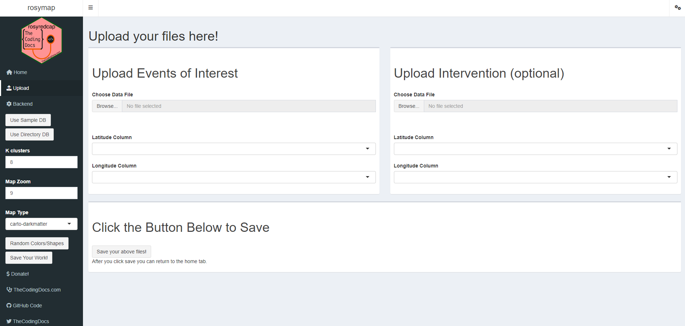

Since I am also a programmer, I am also not a very good writer (or at least have not written a lot of prose recently), so, I will just document my interaction with rosymap, and some additional thoughts.

Installing r and r studio will be different depending on the operating system you are using (apple, windows, linux, etc).

# Installing r

I followed this tutorial

[https://teacherscollege.screenstepslive.com/a/1108074-install-r-and-r-studio-for-windows](https://www.google.com/url?q=https://teacherscollege.screenstepslive.com/a/1108074-install-r-and-r-studio-for-windows&sa=D&source=editors&ust=1699816407318344&usg=AOvVaw3B9BH5WLyQGJyfrMh4Jvht)

Goto [https://cran.r-project.org/](https://www.google.com/url?q=https://cran.r-project.org/&sa=D&source=editors&ust=1699816407319442&usg=AOvVaw0iyi44CY6xagWlVr1VGGoa)


Click on the link corresponding to your operating system

I am on windows, so I will walk through installing on windows


Click on the "install R for the first time" link


Click on the download link

An installer will be downloaded. On windows, you just run the installer. I am not sure what the install process is like on other operating systems. I just used all of the default options.

# Installing r studio

Goto [https://posit.co/](https://www.google.com/url?q=https://posit.co/&sa=D&source=editors&ust=1699816407321551&usg=AOvVaw1cRB4q2z8D-V8RxCnaMf0r)


Click "download r studio"


Click the OTHER "download r studio" button _(hooray for bad user experience)_


Now click one more button, and the installer will download. I just accepted all the default settings.

# Installing rosymap

After this, we can open r studio


This is a screen shot of r studio. I have highlighted the 'Console', where we are going to be entering some text

We need to install rosymap off of github. There is an R 'package' we can use to do this. A 'package' is some existing code that is easy to install within r studio.

We want to type

```install.packages("remotes")```

And hit enter.


Here is the output I got when I did that


There are some error/warning messages, but at the end it seemed to say the 'remotes' package was set up, so I ignored them

Ok, now that "remotes" is installed, we can use it to install rosymap

type

```remotes::install_github("brandonerose/rosymap")```

And hit enter


Here is the output I got when I did that


# Using tidygeocoder to convert addresses to lat/long

Rosy map itself does not convert addresses to lat longs. But, the rosy map website lists another r package that can do this for us.

Type

```install.packages("tidygeocoder")```

And hit enter


Here is the output I got from that


I am not exactly sure what this next command does, but I think it might make the tidygeocoder package ‘available’. In any case, I was just following along with the instructions on the website. **You might want to ask the original author what this is supposed to do**

Type

```library("tidygeocoder")```

And hit enter

There was no output when i did this

Now, the website has some cryptic R nonsense I do not understand well, but it seems like we need to make a _'data frame'_. It contains two lists: a list of place names, and a list of addresses. We then run this 'data frame' through the 'geocode' function from tidygeocoder, and it spits out a table with our input data, and the resolved lat longs.


**I think this part needs more work. Since this is meant to be used by non-coders, there should be a simple function that just takes in a data file (like a csv or somthing) containing place names and addresses, and then spits out a csv file containing the lat longs. Either rosymap itself should contain this function, or there should be instructions on how to install a separate package/library to do this. TLRD: this is a place your coding doctor friend could do a bit more work.**

# Using the rosymap web app

Ok, so we have installed rosymap, and have some lat/longs to work with.

Type

```library("rosymap")```

And hit enter

Again, I am not quite sure what this does, but I did it in case I needed to for the next part to work

Finally, type

```run_app()```

And hit enter.

Here is the output I got when I did that


This opened a tab in my web browser


I clicked on the 'upload' button in the left part of the screen



Here you can upload data files to set your events of interest and your interventions

I used google sheets to make two example csv files


I uploaded them into the webpage


Then I scrolled down and clicked the 'save' button


**Unfortunately, at this point the tab froze up, so I was not able to see the map generated from this data.**

Sorry I was not able to get a map to display. I fiddled with it a bit, in case I had given it bad data, but it just kept freezing when I tried to save. This might be another thing to talk to the author about.